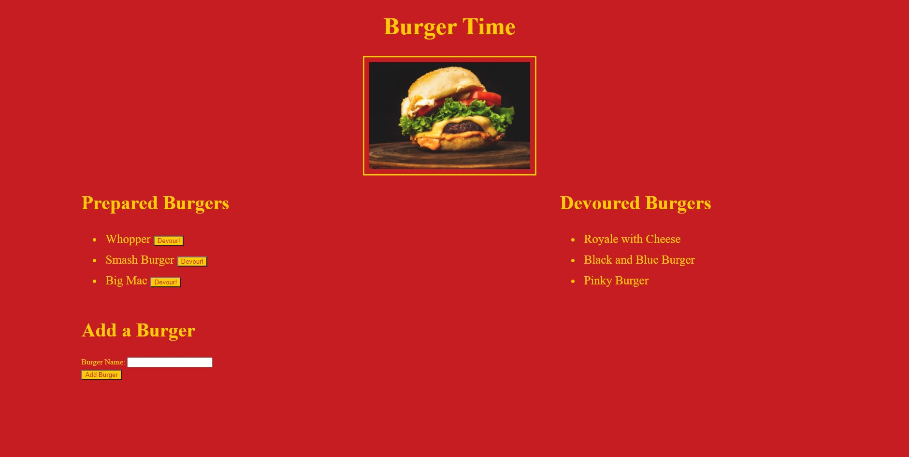

# Burger-Logger
A simple app that allows you to take in burger suggestions add them to a list and then move to another list if selected by a consumer. This will be using: Express, Handlebars, Node and MySQL.

### Table of Contents

* [Description](#Description)

* [Installation](#Installation)

* [Technologies](#Technologies)

* [Usage](##Usage)

* [Contributing](#Contributing)

* [Questions](#Questions)

* [Tests](#Tests)

* [Photos](#Photos)

## Description

This is a fun little project that allows you make suggestions of good burgers and decide if they should be on the delicious list or the suggested list. I was fortunate that we had an in class demostration and template that got me in the right direction (cats).

## Installation Instructions

from node you would npm start

## Technologies Used

* Heroku
* node
* MySql
* Express
* Handlebars
* orm

## Usage

select the buttons if they should be on the delicious list or if they should be on the suggested list. 

## Contributing

email is the best method

## Questions

I can be reached via Github or email, please see the appropriate links below.

Github:
<a href='https://github.com/daviddugle' target='_blank'>daviddugle</a>

Email:
<a href='mailto:david.dugleii@yahoo.com'>david.dugleii@yahoo.com</a>

## Tests

on the app

## Photos

